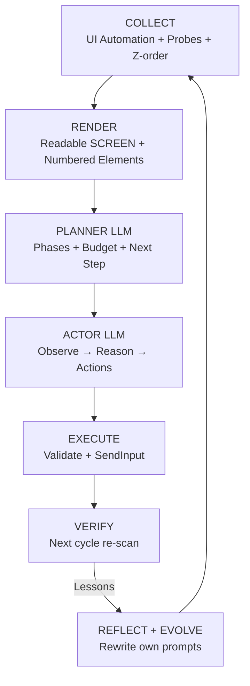

<h1 align="center" style="margin-top: 12px;">Endgame-AI</h1>

<p align="center">
  <strong>The wiring is the intelligence.</strong><br>
  A minimal, local, self-evolving Windows desktop agent.<br>
  <em>No RAG. No skills. No MCP. No API wrappers.</em><br>
  Just perception → planning → action → verification, and prompts that improve themselves.
</p>

<p align="center">
  <a href="#demo-videos">Demo Videos</a> •
  <a href="#how-to-run">How to run</a> •
  <a href="#what-it-actually-is">What it is</a> •
  <a href="#architecture">Architecture</a> •
  <a href="#the-seed-effect">The seed effect</a>
</p>

---

## Demo Videos

Real execution traces. Left = **LM Studio** (local model on consumer hardware). Right = **ACP** backend.

| **LM Studio Run** (Local • gemma-4-E4B Q6) | **ACP Run** (Multi-app • Vague goal) |
|---------------------------------------------|--------------------------------------|
| **Created `hello_world.py` in VS Code, saved it, and clicked "Run Python File"** — 4 evolution cycles on GTX 1060 6GB. | **Completed complex multi-app task** (YouTube + mute + Opera + Grok + copy to Notepad) after evolution fixed the patterns. |
| [](https://github.com/user-attachments/assets/ef4b72d8-bd78-444c-b9fb-d69e0eb30bf4) | [](https://github.com/user-attachments/assets/6314f179-8abe-4d10-9be9-0df2f96228cc) |

---

**Between you and me:**

Endgame-AI is a small set of Python scripts that lets a local LLM control your Windows computer exactly like a human does: it looks at the screen, decides what to click or type, does it, checks if it worked, and repeats until your goal is done.

**Download the zip** from GitHub (no git, no install, no `pip`), unzip, and run:

```bash
python endgame.py "Open VS Code, create hello_world.py that prints hello world, save and run it" 30 --reflect 5 --evolve
```

It gets better at *your* specific tasks over time because it reflects on what worked and rewrites its own instructions after each run — your copy of the system becomes unique to you.

---

**What the logs actually prove**
```
SHAKIRA TEST (ACP)
Vague goal. First action mentioned last. Multi-app. YouTube + mute + Opera + Grok + copy to Notepad.
It did it. After several failed runs, evolution fixed the patterns. The system learned.

VS CODE TEST (GTX 1060 + gemma-4-E4B Q6)
Small model on 6 GB VRAM. Initial targeting failures. After evolution: created file, saved it,
clicked "Run Python File", and it worked. 4 cycles. No crash. Prompts got better.
```

---

## What it actually is

Endgame is a **closed-loop GUI agent** built on native Windows UI Automation. It:

- Collects rich, structured screen state (windows, elements, roles, enabled states, z-order, focused window) **without vision models**.
- Uses a Planner → Actor loop with explicit budget tracking and phase decomposition.
- Executes real mouse/keyboard actions via low-level `SendInput`.
- Verifies every action in the next cycle using fresh UI state.
- Optionally runs **post/middle-run reflection** that rewrites the planner and actor system prompts based on concrete lessons.

**Proven on real hardware:**

- **GTX 1060 6 GB + gemma-4-E4B Q6_K_XL** (LM Studio): Created `hello_world.py` in VS Code, saved it, and executed it via the "Run Python File" button in **4 cycles** of evolution.
- **ACP backend**: Completed a deliberately vague multi-app goal. It handled the out-of-order request, muted the video correctly, and succeeded.

These claims are from full execution traces with logs, verified state, and prompt evolution — not toy demos.

---

## Architecture



**Key insight**: The LLM is the brain. Everything else is dumb, honest plumbing that gives it the best possible current picture of reality every cycle.

---

## How to run

1. Go to the repo → **Code → Download ZIP**
2. Unzip anywhere
3. Open terminal in the folder:

```bash
python endgame.py "your goal here" [max_cycles] [backend] [options]
```

**Recommended first run:**

```bash
python endgame.py "Open Notepad and type Hello from Endgame" 15 --reflect 3 --evolve
```

**Useful options:**
- `--reflect N` — reflect every N cycles
- `--evolve` — actually improve the prompts (this is where it gets interesting)
- `--req-tokens-max N` — hard cap on tokens for cloud models

No virtualenv. No dependencies. Pure Python + Windows.

---

## The seed effect

When you run Endgame with `--evolve`, it doesn't just complete the task — it **learns**.

After/During the run it analyzes what worked and what failed, then rewrites parts of its own planner and actor prompts.

Your copy of Endgame slowly becomes a different, better version than anyone else's. The GitHub repo is only the starting genome. The living intelligence grows on *your* machine.

This is why I call it Endgame.

---

## Honest reality check

**What works well today:**
- Real desktop work on Windows
- Multi-app workflows
- Recovery from its own mistakes
- Self-improvement during/across runs
- Completely local & private

**What is still rough:**
- Planner/actor state can temporarily desync (the `--evolve` flag + system itself solves most of this)
- Currently Windows-only

This is a working prototype that has already shown real breakthrough behavior. With a stronger local model it will become dramatically more capable using the exact same wiring.

---

## Philosophy

Most agent projects add more layers (tools, skills, RAG, frameworks).

Endgame removes layers.

It treats the LLM as the intelligence and gives it the cleanest possible feedback loop about what is actually happening on screen. When the loop is tight and honest, even modest models become useful. When the model gets better, the same system becomes terrifyingly capable.

The future belongs to better **wiring**, not more wrappers.

---

**2026 is the year the wiring won.**

Download it. Run it. Watch it work on your machine.  
Then make it yours.

---

*This README was written after complete forensic analysis of source code + full execution logs from both LM Studio and ACP runs on actual consumer hardware. No hype. Only what the traces prove.*

<p align="center">
  <sub>Built by someone who believes local AI should feel like an extension of your own hands.</sub>
</p>

